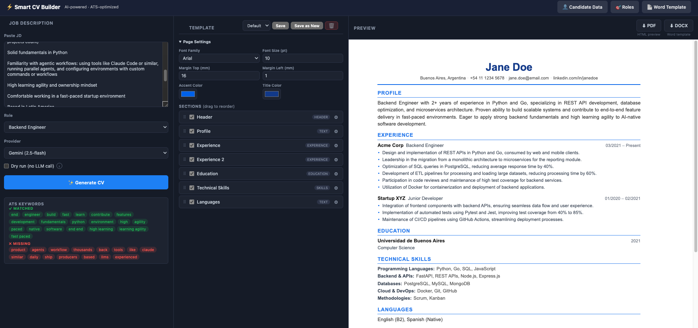

# Smart CV Builder

Herramienta con interfaz web para generar CVs en PDF y Word (.docx) adaptados a una oferta laboral específica, usando LLMs para redactar el perfil, habilidades y bullets de experiencia.

---

## Parte 1 — Instalación y puesta en marcha

### Requisitos previos

- Python 3.10 o superior
- Al menos una API key de algún proveedor LLM (ver sección de providers)
- **macOS**: Homebrew instalado (para instalar dependencias de WeasyPrint)
- **Windows**: [GTK3 Runtime](https://github.com/tschoonj/GTK-for-Windows-Runtime-Environment-Installer/releases) instalado y en el `PATH`
- **Linux**: `apt`/`dnf` disponible (incluido por defecto en la mayoría de distros)

---

### 1. Clonar el repositorio

```bash
git clone <url-del-repo>
cd smart-cv-builder
```

---

### 2. Crear y activar entorno virtual

```bash
python3 -m venv .venv
source .venv/bin/activate
```

---

### 3. Instalar dependencias del sistema (solo una vez)

WeasyPrint necesita librerías nativas para generar PDFs. El comando varía según el sistema operativo:

**macOS:**
```bash
brew install pango cairo gdk-pixbuf
```

**Ubuntu / Debian:**
```bash
sudo apt-get install libpango-1.0-0 libpangoft2-1.0-0 libcairo2 libgdk-pixbuf-2.0-0
```

**Fedora / RHEL:**
```bash
sudo dnf install pango cairo gdk-pixbuf2
```

**Windows:**
Instalar [GTK3 para Windows](https://github.com/tschoonj/GTK-for-Windows-Runtime-Environment-Installer/releases) y asegurarse de que el directorio `bin` de GTK esté en el `PATH`.

---

### 4. Instalar dependencias de Python

```bash
pip install -r requirements.txt
```

---

### 5. Configurar API keys

```bash
cp .env.example .env
```

Abrir `.env` y agregar al menos una key:

```env
GROQ_API_KEY=tu_key_aqui
GEMINI_API_KEY=tu_key_aqui
# OPENAI_API_KEY=
# ANTHROPIC_API_KEY=
# XAI_API_KEY=
```

#### Dónde obtener las API keys

| Provider | URL | Plan gratuito |
|---|---|---|
| **Gemini** | https://aistudio.google.com/app/apikey | ✅ Completamente gratis |
| **Groq** | https://console.groq.com/keys | ✅ Gratis con límite de uso |
| OpenAI | https://platform.openai.com/api-keys |  De pago |
| Anthropic | https://console.anthropic.com/settings/keys |  De pago |
| xAI | https://console.x.ai/ |  De pago |

> **Recomendación:** Para empezar sin costo, usar **Gemini 2.5 Flash** (gratis en Google AI Studio sin necesidad de tarjeta de crédito) o **Groq** (free tier temporal con cuota diaria, muy rápido con Llama 3.3 70B).

---

### 6. Configurar datos del candidato

```bash
cp data/candidate_data.example.json data/candidate_data.json
```

Editar `data/candidate_data.json` con la información real. Ver la [Parte 3](#parte-3--cómo-funciona-el-proyecto) para el detalle de cada campo.

---

### 7. Configurar roles

```bash
cp data/roles.example.json data/roles.json
```

Editar o agregar roles según sea necesario. Cada rol define el contexto que recibe el LLM para enfocar el CV.

---

### 8. (Opcional) Agregar plantilla Word

Si se quiere usar la descarga en `.docx`, colocar una plantilla en `templates/cv_template.docx` con los macros `{{MACRO}}` correspondientes. Se puede subir directamente desde la interfaz web (Settings → Word Template).

---

### 9. Levantar la aplicación

**macOS / Linux:**
```bash
./run_web.sh
```

> El script activa el entorno virtual y configura `DYLD_LIBRARY_PATH` para que WeasyPrint encuentre las librerías de Homebrew en macOS.

**Windows:**
```bash
.venv\Scripts\activate
uvicorn web.main:app --reload --port 8000
```

Abrir en el navegador: **http://localhost:8000**

---

## Parte 2 — La interfaz web

La interfaz está dividida en tres paneles y una barra superior.

---

### Barra superior

- **⚡ Smart CV Builder** — nombre y subtítulo de la app
- **👤 Candidate Data** — abre el editor de datos del candidato (`data/candidate_data.json`)
- **🎯 Roles** — abre el editor de roles (`data/roles.json`)
- **📄 Word Template** — abre el panel para subir o reemplazar la plantilla `.docx`

---

### Panel 1 — Inputs (izquierda)

Donde se configura la generación del CV:

**Job Description** — Pegar el texto completo de la oferta laboral. Cuanto más detallada, mejor el resultado del LLM.

**Role** — Seleccionar el perfil de rol. Define el foco del CV (backend, data, fullstack, etc.). Los roles se configuran en `data/roles.json`.

**Provider** — Seleccionar el proveedor LLM a usar para esta generación:
- Groq (llama-3.3-70b) — Rápido, free tier
- OpenAI (gpt-4o)
- Anthropic (claude-sonnet)
- xAI (grok-3-mini)
- Gemini (2.5-flash) — Gratis

**Dry run** — Activa el modo de prueba: omite la llamada al LLM y rellena el CV con una respuesta mock hardcodeada. Útil para probar el layout, fuentes, colores y orden de secciones sin gastar tokens de API.

**✨ Generate CV** — Ejecuta el pipeline completo y muestra el resultado en el preview.

---

### Panel 2 — Template Editor (centro)

Permite personalizar el diseño del CV sin tocar código:

**Selector de template** — Cambiar entre templates guardados. El template `default` siempre está disponible.

**Save / Save as New / 🗑** — Guardar el template actual, crear una copia con nuevo nombre, o eliminar el template seleccionado (el `default` no se puede eliminar).

**Page Settings** (acordeón desplegable):
- Font Family — Seleccionar entre 12 fuentes (Inter, Roboto, Poppins, Georgia, Arial, etc.)
- Font Size (pt) — Tamaño base del texto (7–14pt)
- Margin Top / Margin Left (mm) — Márgenes de la página
- Accent Color — Color de bordes, títulos de sección y bullets
- Title Color — Color del nombre (h1) en el encabezado

**Sections** — Lista de secciones arrastrables (drag & drop para reordenar). Cada sección tiene:
- **Checkbox de visibilidad** — activar/desactivar la sección en el CV
- **⚙ botón de configuración** — despliega opciones adicionales:
  - Section Title — texto del título de la sección
  - Name Font Size — solo en el header
  - Text Align — left / center / right / justify (por sección)


Cualquier cambio en el editor actualiza el preview en tiempo real (debounce de 300ms).
---

### Panel 3 — Preview (derecha)

Muestra el CV renderizado en un iframe. Es interactivo: se pueden editar los textos directamente haciendo clic sobre ellos (hover con borde azul punteado, focus con borde azul sólido).

**⬇ PDF** — Genera y descarga el PDF usando el HTML del preview (WeasyPrint). Lo que se ve es lo que se descarga.

**⬇ DOCX** — Genera y descarga el archivo Word usando la plantilla `templates/cv_template.docx` con los macros `{{MACRO}}`.

---

### Modal de Settings

Se abre con los botones de la barra superior. Tiene tres pestañas:

**Candidate Data** — Editor JSON de `data/candidate_data.json`. Incluye botones para recargar desde disco y guardar. Los cambios se aplican en la próxima generación.

**Roles** — Editor JSON de `data/roles.json`. Permite agregar, modificar o eliminar roles. Después de guardar, recargar la página para que el dropdown se actualice.

**Word Template** — Muestra la info del archivo actual (`cv_template.docx`) y permite subir uno nuevo. El archivo subido reemplaza al existente en `templates/cv_template.docx`.

---

## Parte 3 — Cómo funciona el proyecto

### Stack tecnológico

| Capa | Tecnología |
|---|---|
| Backend / API | FastAPI + Uvicorn |
| Generación de PDF | WeasyPrint (HTML → PDF) |
| Templates HTML | Jinja2 (`.html.j2`) |
| Generación de DOCX | python-docx (inyección de macros) |
| Validación de datos | Pydantic v2 |
| Frontend | Vanilla JS (ES modules), sin frameworks |
| LLM providers | OpenAI SDK, Anthropic SDK, Groq SDK, Google Generative AI, xAI |

---

### Estructura del proyecto

```
smart-cv-builder/
│
├── generate_cv.py              # CLI (alternativa a la web)
├── run_web.sh                  # Script para levantar la web
├── requirements.txt
├── .env.example                # Copiar a .env y completar API keys
│
├── data/
│   ├── candidate_data.json         # Datos del candidato (gitignored)
│   ├── candidate_data.example.json # Ejemplo para copiar
│   ├── roles.json                  # Definición de roles (gitignored)
│   └── roles.example.json          # Ejemplo para copiar
│
├── templates/
│   └── cv_template.docx        # Plantilla Word con macros {{MACRO}} (gitignored)
│
├── output/                     # CVs generados por CLI (gitignored)
│
├── config/
│   └── settings.py             # Carga .env, expone API keys y paths como singleton
│
├── schemas/
│   ├── candidate.py            # Pydantic: CandidateData, PersonalInfo, Experience, etc.
│   ├── llm_response.py         # Pydantic: LLMResponse, ExperienceLLM
│   └── roles.py                # Pydantic: RoleContext
│
├── core/
│   ├── prompt_builder.py       # Construye el system prompt y user prompt
│   ├── response_parser.py      # Parsea y valida el JSON del LLM (3 capas de fallback)
│   └── word_injector.py        # Inyecta replacements en la plantilla Word
│
├── providers/
│   ├── base.py                 # BaseProvider (interfaz abstracta)
│   ├── factory.py              # get_provider(name) → instancia del provider
│   ├── groq_provider.py
│   ├── openai_provider.py
│   ├── anthropic_provider.py
│   ├── gemini_provider.py
│   └── xai_provider.py
│
└── web/
    ├── main.py                 # FastAPI app, registra routers y sirve estáticos
    ├── dependencies.py         # Dependencias compartidas
    │
    ├── routers/
    │   ├── generate.py         # POST /api/generate
    │   ├── templates_router.py # CRUD /api/templates
    │   ├── export.py           # POST /api/export/pdf, /api/export/docx
    │   ├── ats.py              # POST /api/ats/score
    │   └── data_editor.py      # GET/PUT /api/candidate-data, /api/roles-data, /api/docx-template
    │
    ├── services/
    │   ├── cv_service.py       # Orquesta el pipeline LLM (async)
    │   ├── html_renderer.py    # CvTemplate + replacements → HTML (Jinja2)
    │   ├── pdf_service.py      # WeasyPrint: HTML → bytes PDF
    │   └── ats_service.py      # Scoring ATS sin dependencias externas
    │
    ├── schemas/
    │   ├── api_models.py       # Pydantic: request/response de la API web
    │   └── cv_template_schema.py # Pydantic: CvTemplate, CvTemplateSection, PageConfig
    │
    ├── storage/
    │   └── template_store.py   # Lee y escribe templates JSON en web/cv_templates/
    │
    ├── cv_templates/
    │   ├── default.json            # Template default (gitignored)
    │   └── default.example.json    # Ejemplo del template default
    │
    ├── html_themes/
    │   └── classic.html.j2     # Tema HTML del CV (Jinja2): estilos embebidos + lógica de render
    │
    └── static/
        ├── index.html          # App shell (3 paneles)
        ├── css/app.css
        └── js/
            ├── app.js          # Estado global, llama /api/generate
            ├── editor.js       # Secciones draggables, config de página
            ├── preview.js      # Actualiza el iframe con debounce
            ├── ats.js          # Keywords matched/missing del JD
            └── settings.js     # Modal de settings (candidate, roles, docx)
```

---

### Pipeline de generación

```
POST /api/generate
  → cv_service.run_pipeline()
      → carga candidate_data.json  (CandidateData)
      → carga roles.json           (RoleContext)
      → prompt_builder.build_prompt()
          → system_prompt: reglas estrictas de formato JSON + bullet style
          → user_prompt: JD + rol + skills + summary + historial de experiencias
      → provider.generate(system_prompt, user_prompt)   ← llamada al LLM
      → response_parser.parse_and_validate(raw)
          → 3 capas: strip markdown → json.loads → regex {…} → Pydantic
      → build_replacements()
          → combina datos del candidato (personal, educación, idiomas)
            con output del LLM (perfil, skills, experiencias)
          → devuelve dict {MACRO: valor}
  → html_renderer.render_cv_html(replacements, template)
      → Jinja2 renderiza classic.html.j2 con secciones visibles del template
  → ats_service.score_ats()   ← extrae keywords matched/missing del JD
  → respuesta: { llm_response, preview_html, ats_keywords }
```

---

### Qué procesa el LLM (y qué no)

El LLM **recibe** para reescribir y adaptar:
- `technical_skills` — grupos de habilidades del candidato
- `summary_base` — párrafo base del candidato
- `experience` — historial completo (responsabilidades, logros, tecnologías)

El LLM **NO recibe** (se inyectan directamente desde JSON):
- `personal_info` (nombre, email, teléfono, LinkedIn, ubicación)
- `education`
- `languages`

El LLM **devuelve** (JSON estricto validado por Pydantic):
- `profile` — párrafo de perfil adaptado al JD (50–800 chars)
- `skills` — habilidades agrupadas en formato `Grupo: skill1, skill2 | Grupo: skill1`
- `experiences` — exactamente 2 experiencias con bullets adaptados al JD

---

### Providers LLM

Todos los providers implementan `BaseProvider.generate(system_prompt, user_prompt) -> str`. Los modelos son configurables vía `.env`:

| Provider | Variable de modelo | Default | Nota |
|---|---|---|---|
| Groq | `GROQ_MODEL` | `llama-3.3-70b-versatile` | Free tier |
| Gemini | `GEMINI_MODEL` | `gemini-2.5-flash` | Gratis |
| OpenAI | `OPENAI_MODEL` | `gpt-4o` | De pago |
| Anthropic | `ANTHROPIC_MODEL` | `claude-sonnet-4-6` | De pago |
| xAI | `XAI_MODEL` | `grok-3-mini` | De pago |

> Anthropic usa el parámetro `system=` de su API por separado. Los demás providers incluyen el system prompt como primer mensaje en el array de mensajes.

---

### Templates de CV

Los templates se guardan como JSON en `web/cv_templates/`. Cada template define:
- **page** — fuente, tamaño, márgenes, colores (accent y title)
- **sections** — lista de secciones con orden, visibilidad y configuración individual

El template default (`default.json`) siempre existe y no puede eliminarse. Los templates guardados desde la interfaz son personales y están en `.gitignore`.

---

### Inyección en plantilla Word

La descarga DOCX usa `templates/cv_template.docx` con macros `{{MACRO}}`. El inyector (`core/word_injector.py`) maneja dos tipos:

- **String** → reemplazo de texto en el lugar del macro (con consolidación de runs para manejar la fragmentación XML de Word)
- **List[str]** → el párrafo del macro se clona una vez por bullet y el original se elimina (usado para `{{EXPERIENCE_DESCRIPTION_N}}`)

---

### Macros disponibles para la plantilla Word

| Macro | Contenido |
|---|---|
| `{{FULL_NAME}}` | Nombre completo |
| `{{LOCATION}}` | Ubicación |
| `{{EMAIL}}` | Email |
| `{{PHONE}}` | Teléfono |
| `{{LINKEDIN}}` | URL de LinkedIn |
| `{{PROFILE}}` | Párrafo de perfil (LLM) |
| `{{SKILLS}}` | Skills en grupos (LLM) |
| `{{EXPERIENCE_COMPANY_1}}` / `{{EXPERIENCE_COMPANY_2}}` | Empresa |
| `{{EXPERIENCE_ROLE_1}}` / `{{EXPERIENCE_ROLE_2}}` | Cargo |
| `{{EXPERIENCE_START_DATE_1}}` / `{{EXPERIENCE_START_DATE_2}}` | Fecha inicio |
| `{{EXPERIENCE_END_DATE_1}}` / `{{EXPERIENCE_END_DATE_2}}` | Fecha fin |
| `{{EXPERIENCE_DESCRIPTION_1}}` / `{{EXPERIENCE_DESCRIPTION_2}}` | Bullets (lista) |
| `{{EDUCATION_INSTITUTION_1}}` / `{{EDUCATION_INSTITUTION_2}}` | Institución |
| `{{EDUCATION_DEGREE_1}}` / `{{EDUCATION_DEGREE_2}}` | Título |
| `{{EDUCATION_END_DATE_1}}` / `{{EDUCATION_END_DATE_2}}` | Año de graduación |
| `{{LANGUAGES}}` | Idiomas |
| `{{CERTIFICATIONS}}` | Certificaciones |

---

### Estructura de `candidate_data.json`

| Campo | Descripción |
|---|---|
| `personal_info` | Nombre, ubicación, email, teléfono, LinkedIn |
| `languages` | Idiomas con nivel de dominio |
| `education` | Instituciones, títulos, años de graduación |
| `summary_base` | Párrafo base del candidato (el LLM lo adapta al JD) |
| `technical_skills` | Habilidades agrupadas por categoría (el LLM las reformatea) |
| `experience` | Historial de trabajo completo con responsabilidades, logros y tecnologías |
| `certifications` | Certificaciones opcionales |
| `soft_skills` | Habilidades blandas opcionales |

> Para las experiencias: incluir la mayor cantidad de detalle posible en `responsibilities` y `achievements`. El LLM selecciona y adapta solo lo relevante para cada JD.

---

### Agregar un nuevo provider

1. Crear `providers/<nombre>_provider.py` subclaseando `BaseProvider`
2. Registrarlo en `providers/factory.py`
3. Agregar `<NOMBRE>_API_KEY` y `<NOMBRE>_MODEL` en `config/settings.py` y `.env.example`
4. Agregarlo al `<select>` de providers en `web/static/index.html`

### Agregar un nuevo rol

Editar `data/roles.json` y agregar una nueva entrada con la misma estructura que los existentes. Los campos `focus_areas`, `prioritize_skills`, `bullet_style` y `experience_selection_criteria` guían al LLM para enfocar el CV en ese perfil.
